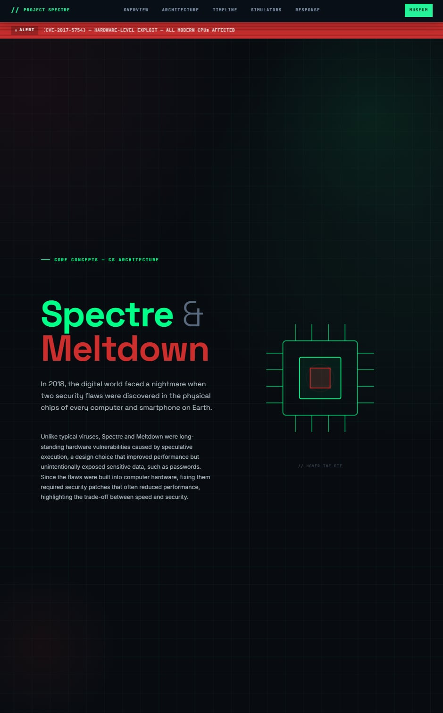
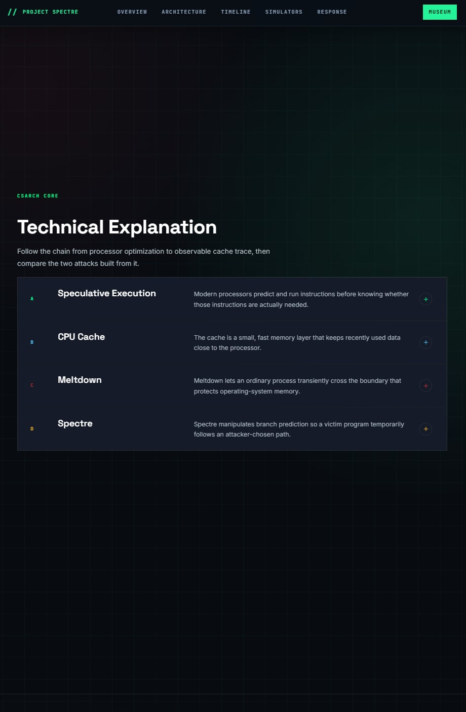
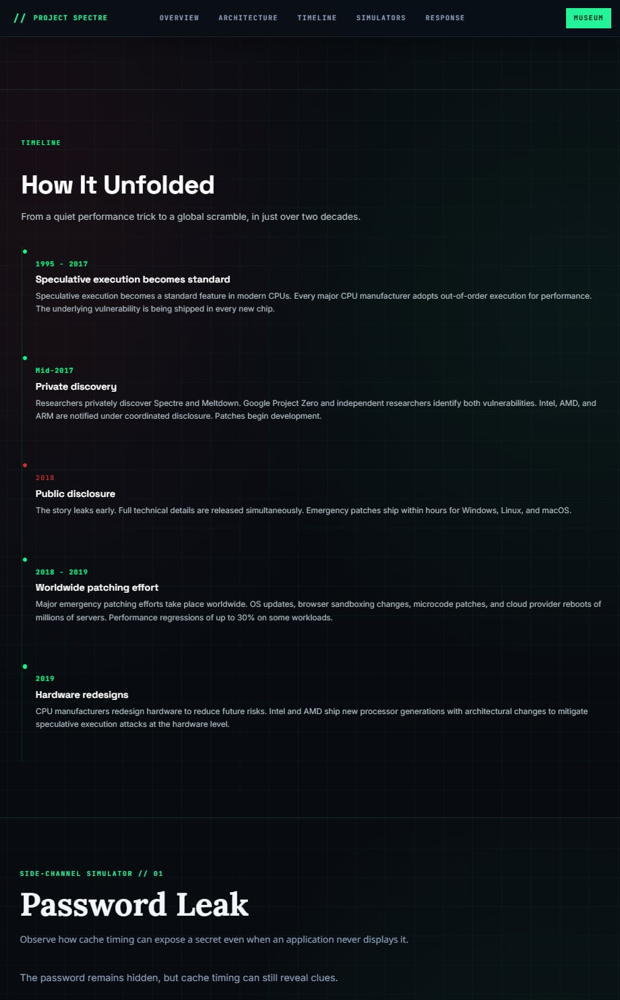

# CSARCH2 Virtual Exhibit Proposal

**Group Name:** _Project Spectre_ 
 
**Topic Theme:** _Spectre and Meltdown Vulnerabilities (2018)_ 
 
**GitHub Link:** https://github.com/Metthy1871/CSARCH2-Virtual-Exhibit
 
**Website viewing Link:** https://imnotneon-dev.github.io/CSARCH2-Virtual-Exhibit/

## Group Members

- Adrian Matthew Dee
- Alain Zuriel Marcos
- Elkan La Madrid
- Jenrick Lim
- Kent Lopez

---

## Tech Stack 

### Frontend 

| Technology  | Role                                                                                                             |
| ----------- | ---------------------------------------------------------------------------------------------------------------- |
| Astro 6     | Primary framework; required by the project template; handles museum page rendering                               |
| React (JSX) | All interactive exhibit elements - simulations and educational games as reusable JSX components embedded via MDX |
| MDX         | Main exhibit content page; combines written content with embedded React components                               |
| CSS         | Styling; used to replicate the visual appearance of a computer security operations center                        |

#### 1. Astro 6

Astro will serve as the primary framework for our virtual exhibit. It is the required framework for the project template and will be responsible for rendering the museum page.

**Will be used for:**

- Easy integration of React components
- Compatible with the central museum website architecture

#### 2. React (JSX)

React will be used to develop all the interactive exhibit elements. The project's simulations and educational games will be implemented as reusable JSX components, displayed in the MDX file. In addition, most of us have experience with using React JSX.

**Will be used for:**

- Password Leak Simulator Component (Interactive Simulation)
- Patch the Memory Leak Game Component (Interactive Game)
- Interactive Timeline Component
- Quiz Components and Popups

#### 3. MDX

MDX will be used to create the main exhibit content page. It combines the introduction and technical explanations with embedded React components for interactive demonstrations.

**Will be used for:**

- Easy content and component placement manipulation
- Integration between text and interactive elements

#### 4. CSS

Traditional CSS will be used to replicate the visual appearance of a computer security operations center and modern processor monitoring tools.

**Planned design elements:**

- Hacker-themed cybersecurity interface
- Terminal windows and command prompts
- CPU monitoring dashboards
- Cache visualization effects
- Warning popups and security alerts
- Responsive layouts for desktop and mobile devices
- Animations showing data leakage and memory access

---

### Backend (Updated)

| Technology | Role                                                                     |
| ---------- | ------------------------------------------------------------------------ |
| Node.js    | Runtime environment for local development and Astro deployment           |
| Express    | Included as a contingency for additional backend functionality if needed |

#### 1. Node.js

Node.js will provide the runtime environment for the backend of our local development and for the deployment of the Astro application. Moreover, it is also very compatible and is required by Astro.

**Will be used for:**

- Compatibility with Astro, since it's required by Astro
- Supports modern JavaScript tooling and is compatible with React (JSX)

#### 2. Express

Express will be used only if additional backend functionality becomes necessary. In addition, the majority of the team has experience in utilizing Express with Node.js.

**Potential uses:**

- Recording quiz scores
- Tracking game completion statistics
- Visitor analytics

---

## I. Proposed Structure

### 1. _Introduction (Story Hook)_ 

In 2018, the digital world faced a nightmare when two security flaws were discovered in the physical chips of every computer and smartphone on Earth. These flaws are known as Spectre and Meltdown. Unlike typical viruses that can easily be deleted, there were "hardware vulnerabilities" that had existed for decades. The problem originated from a design choice to make devices faster by having chips predict the user's next action. However, this speed trick inadvertently left a backdoor for hackers to steal private information, such as passwords. Furthermore, this discovery caused a global panic because the flaw was built into the physical parts of the machines, making it nearly impossible to fix without slowing down computers everywhere. Ultimately, Spectre and Meltdown served as a powerful lesson that the rush for faster technology can create deep security risks that put the entire world's privacy at stake.

### 2. Technical Explanation (CSARCH Core) 

#### a. _Speculative Execution_ 

Modern processors attempt to improve performance by predicting future instructions and executing them ahead of time.

Example:

if (userIsAuthorized)
accessSecretData();

The CPU may temporarily execute the instruction before confirming whether the user is actually authorized.
Normally these speculative operations are discarded. However, traces remain in the CPU cache.

#### b. _CPU Cache_ 

A cache is a small, high-speed memory area that stores frequently used data.

Accessing cached data is significantly faster than retrieving data from main memory.

Attackers can measure timing differences to determine whether certain data was loaded into cache.

#### c. _Meltdown_ 

Meltdown allows an attacker to read privileged kernel memory from an unprivileged application.

It effectively breaks the isolation between:

- User applications
- Operating system memory

Potentially exposed information:

- Passwords
- Encryption keys
- Sensitive operating system data

#### d. _Spectre_ 

Spectre tricks programs into executing instructions they normally would not execute.

Instead of directly bypassing permissions, it manipulates speculative execution behavior to leak data through cache timing.

Potentially affected:

- Browsers
- Applications
- Virtual machines
- Cloud computing environments

### 3. _Timeline (Visual Section)_ 

| Period    | Event                                                           |
| --------- | --------------------------------------------------------------- |
| 1995-2017 | Speculative execution becomes a standard feature in modern CPUs |
| Mid-2017  | Researchers privately discover Spectre and Meltdown             |
| 2018      | Major emergency patching efforts worldwide                      |
| 2019      | CPU manufacturers redesign hardware to reduce future risksy     |

---

## II. Interactive Components 

### 1. _Interactive Simulation - "The Hidden Password Leak"_ 
**Concept:** Demonstrates how sensitive data can remain hidden from the user interface but still be exposed through cache side-channel attacks.

**Gameplay:**

The user sees:

Password: \***\*\*\*\*\*\*\***

The system appears secure.

A button labeled: "View as Attacker" switches perspectives.

The attacker view displays a cache-monitoring panel.

As the user triggers memory accesses, portions of the password gradually become visible:

- P\***\*\*\*\*\*\***
- Pa\***\*\*\*\*\***
- Pas\***\*\*\*\***
- Pass**\*\*\*\***

until the entire password is reconstructed.

**What it teaches:**

- Difference between displayed data and stored data
- Cache side-channel attacks
- Why Spectre and Meltdown were dangerous
- Information leakage without directly reading memory

---

### 2. Interactive Game: Speculative Execution Lab

**Concept:**  
This game turns the player into the CPU. Each round presents a branch instruction, prediction confidence, data sensitivity, and branch history. The player must balance performance against the risk of leaving cache traces behind.

**Gameplay:**

- The game runs through 10 randomized instruction rounds.
- Each round shows an instruction card with branch history, prediction, confidence, data type, and base risk.
- The player chooses one of four CPU behaviors:
    - Wait for Check
    - Speculate
    - Speculate + Flush
    - Insert Fence
- Speculation can save cycles and increase performance, but risky speculation can raise cache trace risk.
- Waiting, flushing, and fencing reduce risk but spend more of the cycle budget.
- The run ends when all rounds are cleared, cache trace risk reaches 100%, or the cycle budget reaches 0.

**Outcome states:**

- Complete
- Cache Leak
- Budget Exhausted

**Possible verdicts:**

- Balanced CPU Behavior
- High Performance, Moderate Risk
- Secure but Slow
- Risky Optimization
- Speculative Leak
- Over-Serialized Pipeline

**What it teaches:**

- Speculative execution improves performance but can leave observable side effects
- Discarded speculative results do not necessarily erase cache traces
- Sensitive or protected data requires more cautious CPU behavior
- Mitigations such as waiting, flushing, and fencing have performance costs

---

### 3. _Interactive Game – "Patch the Memory Leak"_ 

**Concept:** You are a cybersecurity engineer responding to the disclosure of Spectre and Meltdown. Your goal is to secure critical systems before attackers steal sensitive data.

**Gameplay:**

A briefing screen opens the game with the scenario, a how-to-play walkthrough, and a description of every action, before a **Start Incident Response** button begins the run.

Players are given a set of vulnerable systems:

- `[1]` Banking Server (Critical)
- `[2]` Cloud Database (Critical)
- `[3]` Hospital Records (High)
- `[4]` Government Portal (High)
- `[5]` Web Browser (Medium)

Each system requires a different patching effort, and only **2 engineers** can work at once; attempting a 3rd action is blocked until one finishes.

The player has a shared **90-second countdown** (limited time) and a **2-engineer capacity** (limited resources).

Possible actions (all 5 are available on every system):

- Apply Operating System Patch
- Install Browser Update
- Enable Kernel Isolation
- Deploy Security Monitoring
- Ignore Risk

Every choice consumes time; even Ignore Risk, which takes a few seconds to log.

Each system has one or two _correct_ actions (e.g., the Web Browser needs a Browser Update; servers need an OS Patch or Kernel Isolation). Applying the right patch **fully secures** the system. Applying the **wrong** patch still costs the full time but does nothing; the system is left "Misapplied." Deploy Security Monitoring is faster than a full patch but only ever gives **partial** coverage. The run ends when the timer hits zero, or immediately if every system is fully secured first.

**Outcome states:**

- Both critical systems (Banking Server, Cloud Database) fully secured, and everything else secured or monitored → **Secure Infrastructure** ending
- Critical systems held, but a system was missed, misapplied, or only monitored → **Partial Breach** ending
- A critical system left vulnerable, ignored, misapplied, or still mid-patch when time runs out → **Major Security Incident** ending
- **What it teaches:**
- Real-world cybersecurity incident response
- Resource prioritization under time pressure and staffing limits
- Importance of patch management
- Why organizations spent significant resources mitigating Spectre and Meltdown

---

## III. _Proposed Design Layout_

### PC Display 

### Mobile Display 

Mobile Optimizations:

- Touch-friendly controls
- Simplified CPU diagrams
- Responsive timeline cards
- Compact security dashboards

---

# Final Development Documentation
## Proposal
- The group originally planned to feature the Y2K Bug (2000) in this virtual exhibit. However, since another group had already chosen the same topic, the group decided to focus instead on the Spectre and Meltdown vulnerabilities.

## All Technical and Creative Accomplishments

- Created the full exhibit page (`Spectre_Vulnerability.mdx`) with everything including hero + concepts + timeline + simulation + games
- Created 7 interactive React components for:
    - `PasswordLeak.jsx` - reconstructs an invisible password using timing measurements to illustrate cache side-channel attacks
    - `SpeculativeExecutionLab.jsx` - CPU pipeline decision game that pits speed against cache trace risk.
    - `PatchMemoryLeak.jsx` - Incident response game where the user has to patch vulnerable machines within a time limit.
    - `Intro.jsx` - Landing page hero section that introduces Spectre and Meltdown with dramatic visual impact.
    - `TextWithImage.astro` - Reusable layout component for pairing explanatory text with visual content.
    - `TechExplanation.jsx` - Educational component explaining core concepts through interactive cards.
    - `Timeline.jsx` - click through interactive timeline 1995 + to discover how and why Spectre happened.
- Applied a full CSS theme replicating a cybersecurity terminal / security operations center aesthetic
- Configured GitHub Pages deployment via GitHub Actions (`astro.yml`)
- Added AI disclosure and references to both the README and the exhibit page
- Created our own Astro layout file (S03_Group_7_SpectreLayout.astro) to make the website feel more full and exciting.
- Additional CSS file for website layout (S03_Group_7_layout.css)
- Implemented scroll-driven animations, transition effects, and graphic polish across components to enhance the visuals of the website by integrating dynamic graphics and micro-interactions (hover effects, entrance reveals)
- Added a timer and interactive features like streaks on password leak and speculative lab
- Modified and enchanced the UI of all interactive game sand timelines

## All Challenges

- Deciding what design to use for the webpage
- How GitHub Pages Routes Are Affected by Base in Astro
- React components to be hydrated interactively inside MDX files
- All four components need to be visually consistent with the shared CSS style guide
- Fixing 404s caused by base path prefix not being included in local dev
- Exploring ways to make the website feel less static or PPT-like
- Creating a custom Astro layout to enhance the overall design and user experience

## All Aha Moments

- You need to add `client:load` to every React component you import into MDX render as regular static HTML with no interactivity
- The `base` value in `astro. config`. When deploying your app, mjs` must have the same capitalization as the GitHub repo name, or all of your assets and routes break.
- MDX allows mixing raw HTML, Markdown, and JSX imports in the same file, which made structuring the exhibit page much more flexible than expected
- Realizing that Astro strips client-side JavaScript from React components in MDX by default was a turning point. Adding client:load / client:visible instantly brought our interactive games and animation hooks back to life.
- Creating S03_Group_7_SpectreLayout.astro showed us how cleanly Astro handles slotted content. We could build an entirely custom exhibit look and feel without risking global style conflicts on the host site.

## Completed Final Checking

- Proofread and verified all technical content against the provided references
- Completed mobile responsiveness testing for all interactive components
- Added and enhanced the animations and visual enhancements to interactive elements.
- Completed final checking to ensure the exhibit met all template requirements before submission

---

## Disclosure on the Use of AI / LLM Tools

The team utilized AI tools such as **ChatGPT** and **Gemini** to help break down complex architectural concepts regarding the Spectre vulnerability during our research. Additionally, AI was used for brainstorming our UI and optimizing our CSS styling for our React components.

All core content, historical analysis, and actual implementation of the interactive exhibit were executed entirely by us. AI tools were merely used to support our learning and polish the user experience.

| Tool    | Purpose                                                               |
| ------- | --------------------------------------------------------------------- |
| ChatGPT | Breaking down Spectre/Meltdown architectural concepts during research |
| Gemini  | UI brainstorming and React component design discussion                |

---

## References

Aktas Aydin, H. (2023). _SPECTRE: Analysis of attacks and defense mechanisms against Spectre._

Kee, W.J., Abdul Kadir, M.F., Wahab, F.A., Zakaria-Mohamad, A.H., Mohamed, M.A., & Abidin-Bharun, A.F.A. (2018). A review on Spectre attacks and Meltdown with its mitigation techniques. _International Journal of Engineering and Technology (UAE), 7_, 209-213.

Lipp, M., Schwarz, M., Gruss, D., Prescher, T., Haas, W., Mangard, S., Kocher, P., Genkin, D., Yarom, Y., & Hamburg, M. (2018). _Meltdown._

Smith, A. (2003). Cache memory. 180-187.

Wahab, F., Zakaria, A., Mohamed, M.A., & Abdul Kadir, M.F. (2020). Mitigating risk of Spectre and Meltdown vulnerabilities. _8_, 741-746.
