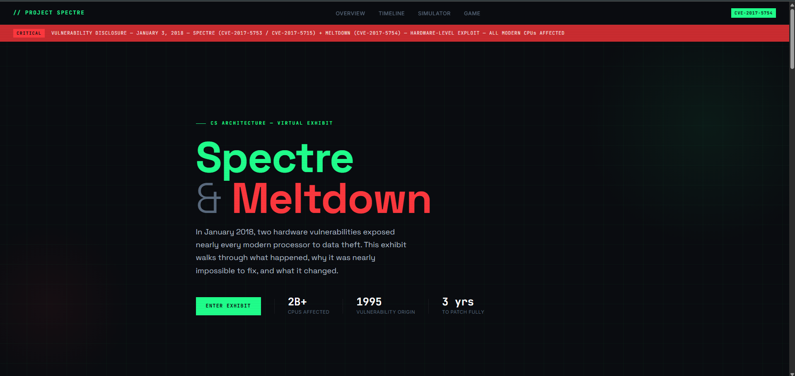
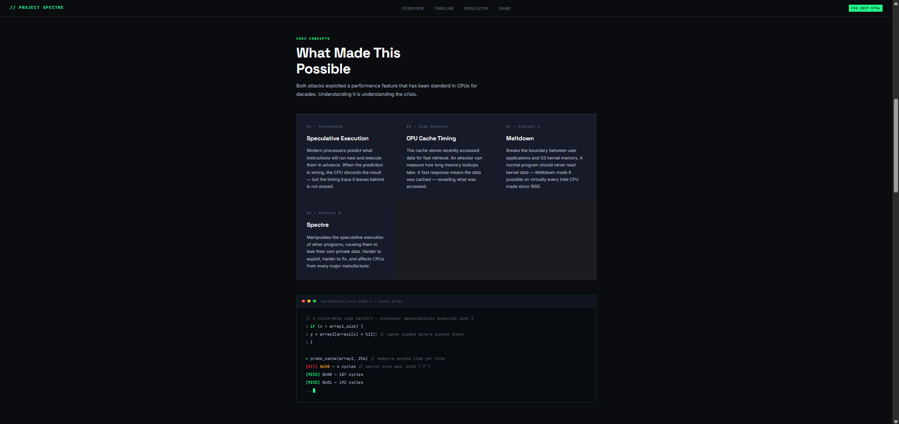
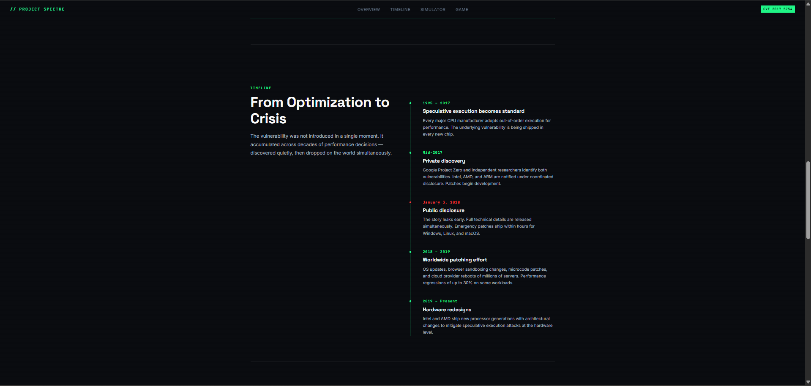
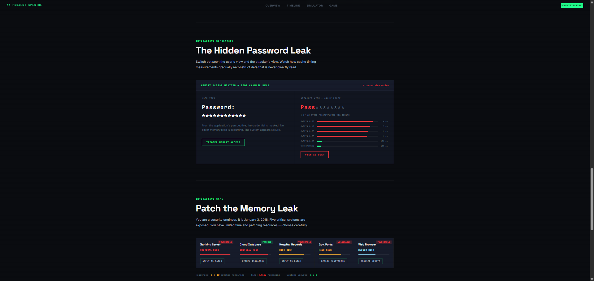
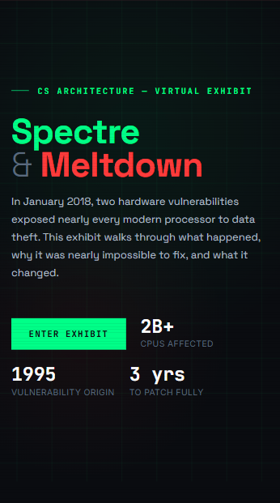
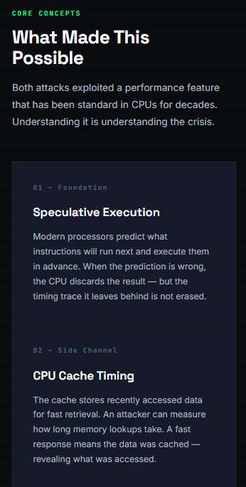
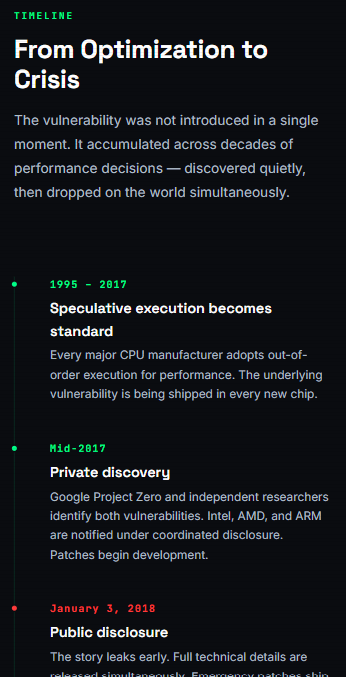
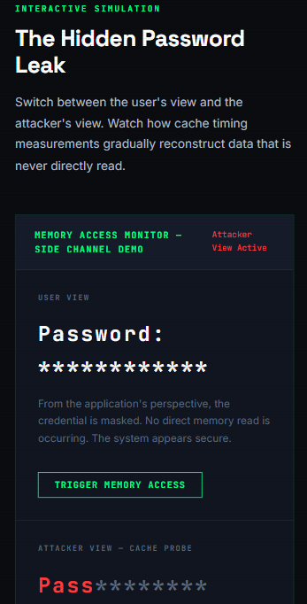

# CSARCH2 Virtual Exhibit Proposal

**Group Name:** *Project Spectre* (Updated)   
**Topic Theme:** *Spectre and Meltdown Vulnerabilities (2018)* (Updated)
 
**GitHub Link:** https://github.com/Metthy1871/CSARCH2-Virtual-Exhibit-Proposal

## Group Members

- Adrian Matthew Dee
- Alain Zuriel Marcos
- Elkan La Madrid
- Jenrick Lim
- Kent Lopez

---

## Tech Stack (Updated)

### Frontend (Updated)

| Technology | Role |
|---|---|
| Astro 6 | Primary framework; required by the project template; handles museum page rendering |
| React (JSX) | All interactive exhibit elements - simulations and educational games as reusable JSX components embedded via MDX |
| MDX | Main exhibit content page; combines written content with embedded React components |
| CSS | Styling; used to replicate the visual appearance of a computer security operations center |

#### 1. Astro 6

Astro will serve as the primary framework for our virtual exhibit. It is the required framework for the project template and will be responsible for rendering the museum page.

**Will be used for:**
- Easy integration of React components
- Compatible with the central museum website architecture

#### 2. React (JSX)

React will be used to develop all the interactive exhibit elements. The project's simulations and educational games will be implemented as reusable JSX components, displayed in the MDX file. In addition, most of us have experience with using React JSX.

**Will be used for:**
- Password Leak Simulator Component (Interactive Simulation)
- Patch the Memory Leak Game Component (Interactive Game)
- Interactive Timeline Component
- Quiz Components and Popups

#### 3. MDX

MDX will be used to create the main exhibit content page. It combines the introduction and technical explanations with embedded React components for interactive demonstrations.

**Will be used for:**
- Easy content and component placement manipulation
- Integration between text and interactive elements

#### 4. CSS

Traditional CSS will be used to replicate the visual appearance of a computer security operations center and modern processor monitoring tools.

**Planned design elements:**
- Hacker-themed cybersecurity interface
- Terminal windows and command prompts
- CPU monitoring dashboards
- Cache visualization effects
- Warning popups and security alerts
- Responsive layouts for desktop and mobile devices
- Animations showing data leakage and memory access

---

### Backend (Updated)

| Technology | Role |
|---|---|
| Node.js | Runtime environment for local development and Astro deployment |
| Express | Included as a contingency for additional backend functionality if needed |

#### 1. Node.js

Node.js will provide the runtime environment for the backend of our local development and for the deployment of the Astro application. Moreover, it is also very compatible and is required by Astro.

**Will be used for:**
- Compatibility with Astro, since it's required by Astro
- Supports modern JavaScript tooling and is compatible with React (JSX)

#### 2. Express

Express will be used only if additional backend functionality becomes necessary. In addition, the majority of the team has experience in utilizing Express with Node.js.

**Potential uses:**
- Recording quiz scores
- Tracking game completion statistics
- Visitor analytics

---

## I. Proposed Structure

### 1. *Introduction (Story Hook)* (Updated)

In 2018, the digital world faced a nightmare when two security flaws were discovered in the physical chips of every computer and smartphone on Earth. These flaws are known as Spectre and Meltdown. Unlike typical viruses that can easily be deleted, there were "hardware vulnerabilities" that had existed for decades. The problem originated from a design choice to make devices faster by having chips predict the user's next action. However, this speed trick inadvertently left a backdoor for hackers to steal private information, such as passwords. Furthermore, this discovery caused a global panic because the flaw was built into the physical parts of the machines, making it nearly impossible to fix without slowing down computers everywhere. Ultimately, Spectre and Meltdown served as a powerful lesson that the rush for faster technology can create deep security risks that put the entire world's privacy at stake.

### 2. Technical Explanation (CSARCH Core) (Updated)

#### a. *Speculative Execution* (Updated)

Modern processors attempt to improve performance by predicting future instructions and executing them ahead of time.

Example:

if (userIsAuthorized)
   accessSecretData();
   
The CPU may temporarily execute the instruction before confirming whether the user is actually authorized.
Normally these speculative operations are discarded. However, traces remain in the CPU cache.

#### b. *CPU Cache* (Updated)

A cache is a small, high-speed memory area that stores frequently used data.

Accessing cached data is significantly faster than retrieving data from main memory.

Attackers can measure timing differences to determine whether certain data was loaded into cache.

#### c. *Meltdown* (Updated)

Meltdown allows an attacker to read privileged kernel memory from an unprivileged application.

It effectively breaks the isolation between:
- User applications
- Operating system memory

Potentially exposed information:
- Passwords
- Encryption keys
- Sensitive operating system data

#### d. *Spectre* (Updated)

Spectre tricks programs into executing instructions they normally would not execute.

Instead of directly bypassing permissions, it manipulates speculative execution behavior to leak data through cache timing.

Potentially affected:
- Browsers
- Applications
- Virtual machines
- Cloud computing environments

### 3. *Timeline (Visual Section)* (Updated)

| Period | Event |
|---|---|
| 1995-2017 | Speculative execution becomes a standard feature in modern CPUs |
| Mid-2017 | Researchers privately discover Spectre and Meltdown |
| 2018 | Major emergency patching efforts worldwide |
| 2019 | CPU manufacturers redesign hardware to reduce future risksy |

---

## II. Interactive Components (Updated)

### 1. *Interactive Simulation - "The Hidden Password Leak"* (Updated)

**Concept:** Demonstrates how sensitive data can remain hidden from the user interface but still be exposed through cache side-channel attacks.

**Gameplay:**

The user sees:

Password: ************

The system appears secure.

A button labeled: "View as Attacker" switches perspectives.

The attacker view displays a cache-monitoring panel.

As the user triggers memory accesses, portions of the password gradually become visible:
- P***********
- Pa**********
- Pas*********
- Pass********

until the entire password is reconstructed.

**What it teaches:**
- Difference between displayed data and stored data
- Cache side-channel attacks
- Why Spectre and Meltdown were dangerous
- Information leakage without directly reading memory
  
---

### 2. *Interactive Game - "Patch the Memory Leak"* (Updated)

**Concept:** You are a cybersecurity engineer responding to the disclosure of Spectre and Meltdown. Your goal is to secure critical systems before attackers steal sensitive data.

**Gameplay:**

Players are given a set of vulnerable systems:
  - `[1]` Banking Server
  - `[2]` Cloud Database
  - `[3]` Hospital Records
  - `[4]` Government Portal
  - `[5]` Web Browser
  
Each system requires a different patching effort.

The player has limited time and resources.

Possible actions:
- Apply Operating System Patch
- Install Browser Update
- Enable Kernel Isolation
- Ignore Risk
- Deploy Security Monitoring
  
Every choice consumes time.

**Outcome states:**
- Most critical systems patched - **Secure Infrastructure** ending
- Systems missed - **Partial Breach** ending
- Critical systems ignored - **Major Security Incident** ending

**What it teaches:**
- Real-world cybersecurity incident response
- Resource prioritization
- Importance of patch management
- Why organizations spent significant resources mitigating Spectre and Meltdown

---

## III. *Proposed Design Layout*

### PC Display

### Mobile Display

Mobile Optimizations:
- Touch-friendly controls
- Simplified CPU diagrams
- Responsive timeline cards
- Compact security dashboards

---

# Mid-Milestone Update: Project Spectre

**Deployment Link:** https://jrgo7.github.io/virtual-exhibit-template/Spectre_Vulnerability

---

## What's Been Done
- Built the full exhibit page (`Spectre_Vulnerability.mdx`) with all content sections including hero, concepts, timeline, simulation, and games
- Implemented 4 interactive React components:
  - `PasswordLeak.jsx` - demonstrates cache side-channel attacks by reconstructing a hidden password through timing measurements
  - `SpeculativeExecutionLab.jsx` - CPU pipeline decision game where the player balances speed against cache trace risk
  - `PatchMemoryLeak.jsx` - incident response game where the player patches vulnerable systems before a timer runs out
  - `SpectreTimeline.jsx` - clickable interactive timeline covering 1995 to present
- Applied a full CSS theme replicating a cybersecurity terminal / security operations center aesthetic
- Configured GitHub Pages deployment via GitHub Actions (`astro.yml`)
- Added AI disclosure and references to both the README and the exhibit page

## Challenges
- Understanding how Astro's `base` path configuration affects routing for GitHub Pages
- Getting React components to hydrate interactively inside MDX files
- Keeping all four components visually consistent with the shared CSS style guide
- Resolving 404 errors caused by the `base` path prefix not being included in the local dev URL

## Aha Moments
- `client:load` is required on every React component embedded in MDX - without it, components render as static HTML with no interactivity
- The `base` value in `astro.config.mjs` must exactly match the GitHub repo name including capitalization, otherwise all assets and routes break on deployment
- MDX allows mixing raw HTML, Markdown, and JSX imports in the same file, which made structuring the exhibit page much more flexible than expected

## What's Left for Final Submission
- Final proofreading and accuracy check of all technical content against references
- Mobile responsiveness testing across all four interactive components
- Additional animations and visual polish on interactive elements
- Final review to ensure the exhibit meets all museum template requirements before the merge

---

## Disclosure on the Use of AI / LLM Tools

The team utilized AI tools such as **ChatGPT** and **Gemini** to help break down complex architectural concepts regarding the Spectre vulnerability during our research. Additionally, AI was used for brainstorming our UI and optimizing our CSS styling for our React components.

All core content, historical analysis, and actual implementation of the interactive exhibit were executed entirely by us. AI tools were merely used to support our learning and polish the user experience.

| Tool | Purpose |
|---|---|
| ChatGPT | Breaking down Spectre/Meltdown architectural concepts during research |
| Gemini | UI brainstorming and React component design discussion |

---

## References

Aktas Aydin, H. (2023). *SPECTRE: Analysis of attacks and defense mechanisms against Spectre.*

Kee, W.J., Abdul Kadir, M.F., Wahab, F.A., Zakaria-Mohamad, A.H., Mohamed, M.A., & Abidin-Bharun, A.F.A. (2018). A review on Spectre attacks and Meltdown with its mitigation techniques. *International Journal of Engineering and Technology (UAE), 7*, 209-213.

Lipp, M., Schwarz, M., Gruss, D., Prescher, T., Haas, W., Mangard, S., Kocher, P., Genkin, D., Yarom, Y., & Hamburg, M. (2018). *Meltdown.*

Smith, A. (2003). Cache memory. 180-187.

Wahab, F., Zakaria, A., Mohamed, M.A., & Abdul Kadir, M.F. (2020). Mitigating risk of Spectre and Meltdown vulnerabilities. *8*, 741-746.

